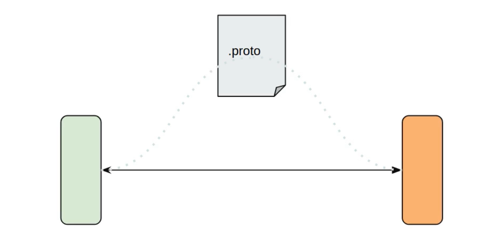
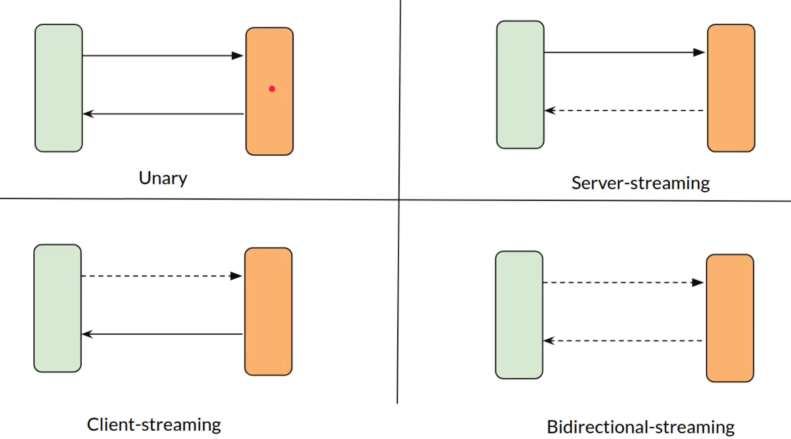
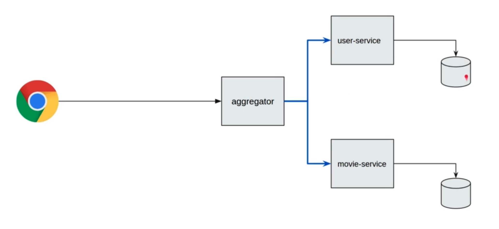

****

# gRPC INTRODUCTION

Repo based on this udemy course: [gRPC the complete guide for java developers](https://www.udemy.com/course/grpc-the-complete-guide-for-java-developers/).

## REPO STRUCTURE

1. Folder - Protocol Buffers: 

   - IDL (interface description language) for API

   - Platform neutral

   - Language neutral

   - Serializing/ Deserializing structured data

   - Optimized for interservices communication

   - Provides client libraries automatically for many languages.

2. Folder - gRPC Introduction:

   - High-performance, open source RPC framework
   - Developed at Google
   - Client app directly invokes Server method on a different machine
   - Service is defined using proto.

   We will generate an abstract class, our interface in the .proto file, which needs to be implemented by the server. Through this policy tool, is it possible to generate automatically STUB in most of the languages. The client will be using that client library generated by the policy tool to interact with that server.
   Client's call generated by the stub are offered in Async or Sync fashion (in case of Async you need to register a callback for the async behavior).
   

   There are 4 different types of RPC these days:
   - **UNARY** : One request—One response, RPC is completed once the client receives the response from the server.
   - **SERVER-STREAMING**: The client send one request and the server send multiple response (Streaming), can be multiple chunks of a pagination.
   - **CLIENT-STREAMING**: The client send multiple streaming request and the server send one response. An example is a file upload, a client maybe sending a file in small chunks and once it is completed the server sends back a response saying that the file was uploaded.
   - **BIDIRECTIONAL-STREAMING**: Completely independent, client can send many requests, as well as the server.

   

3. Folder - Spring boot integratrion project with gRPC and Protocol buffers:

   